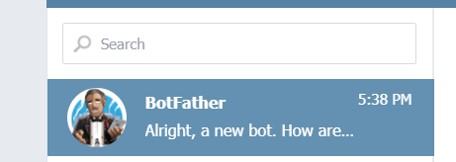
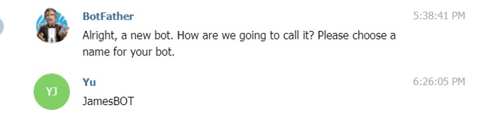
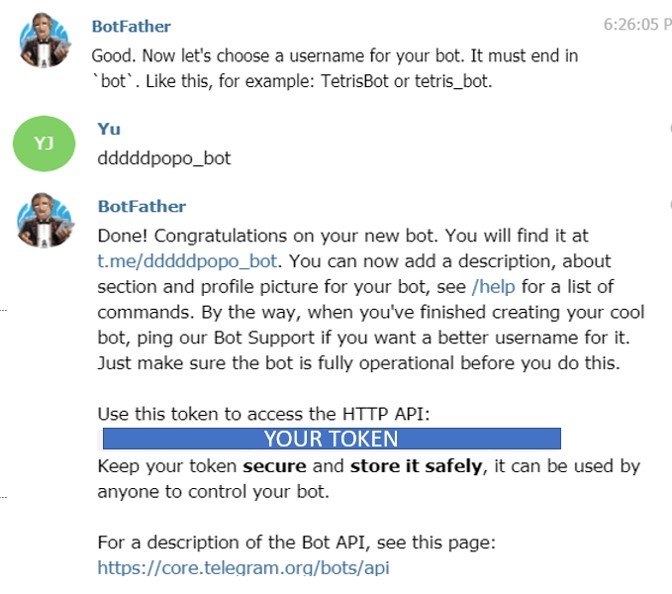
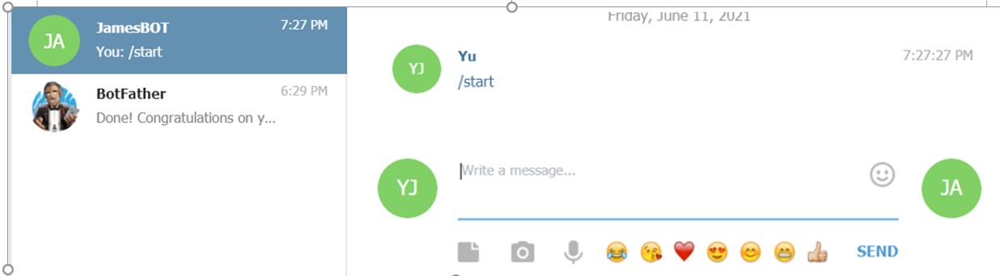
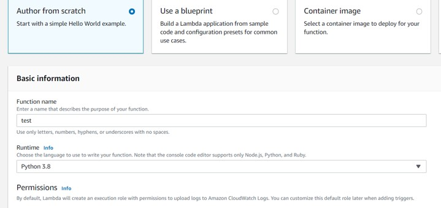
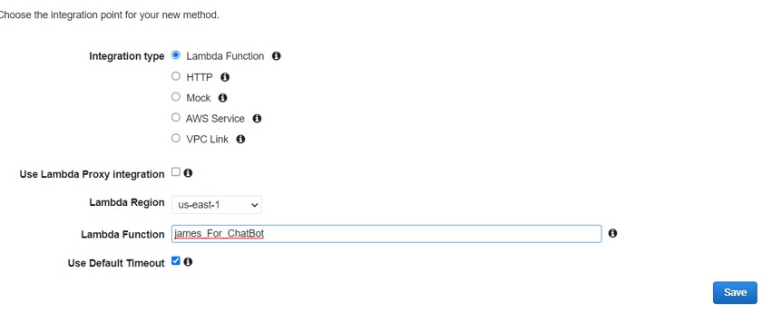
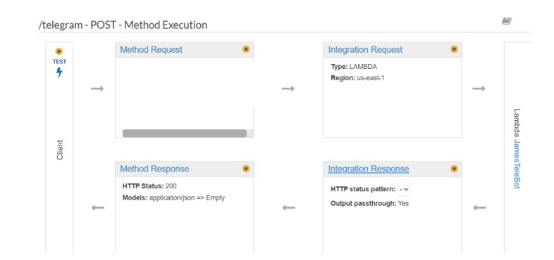
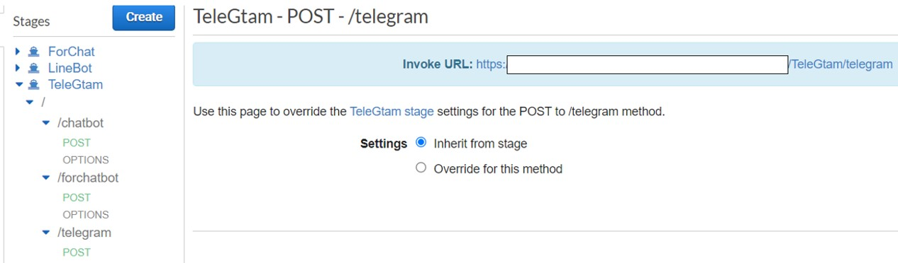
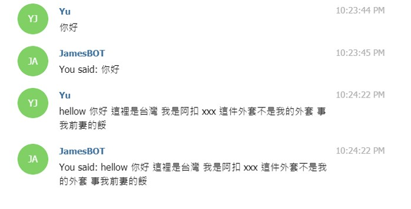

# Create Telegram Bot


## Intorduction

In this lab, i will show how to use AWS lambda with apigateway to connect Telegrambot to create the chatbot , so you need the:
1. AWS coount 
2. Install Telegram 
3. Python

# Step by step :


## Create telegram bot
1. Open telegram and Search BotFather


2. Choose a name for your bot



3. Choose a username for your bot. It must end in `bot`. Like this, for example: TetrisBot or tetris_bot.


4. Search the bot you just create .



## Create Lambda Function

1. Login your AWS account
2. Search `lambda` in console 
3. click create function select `Author from scrath`  and click the fucntion name and choose `Python3.8` for runtime and click `Create Function`

4. Import `requests` on lambda : You can use layer or other people's arn to upload the package. You can read the refference as below.


    [Keith's Layers (Klayers)](https://github.com/keithrozario/Klayers "Keith's Layers (Klayers)")

    [Getting started with AWS Lambda Layers for Python](https://medium.com/the-cloud-architect/getting-started-with-aws-lambda-layers-for-python-6e10b1f9a5d "Getting started with AWS Lambda Layers for Python")

5. lambda_function.py looks like the code below , change `TELE_TOKEN` to your bot token.
    ```python
    import json
    import requests

    TELE_TOKEN="<Your Token>"
    URL = "https://api.telegram.org/bot{}/".format(TELE_TOKEN)


    def send_message(text, chat_id):
        final_text = "You said: " + text
        url = URL + "sendMessage?text={}&chat_id={}".format(final_text, chat_id)
        jj=requests.post(url)


    def lambda_handler(event, context):
        
        chat_id = event['message']['from']['id']
        sent = event['message']['text']
        print(sent)
        send_message(sent,chat_id)
    ```
## Create api-gateway
1. Search api-Gateway in your console
2. Click create API and Select REST API and create the post method api
3. Let lambda function be your endpoint

4. Check your endpoint is your lambda function

5. Click stage and find your function , copy the invoke url because we will use this url to set webhook.

    


## Setting webhook 

1. You can use url below to check your information.
    ```python
    https://api.telegram.org/bot<Your BOT Token>/getMe
    ```
2. Paste invoke url you just copy to browser to set the webhook
    ```python
    https://api.telegram.org/bot<YOUR BOT TOKEN>/setWebhook?url=<invoke url>
    ```
3. Click something to you bot , and it will return the same.

    

